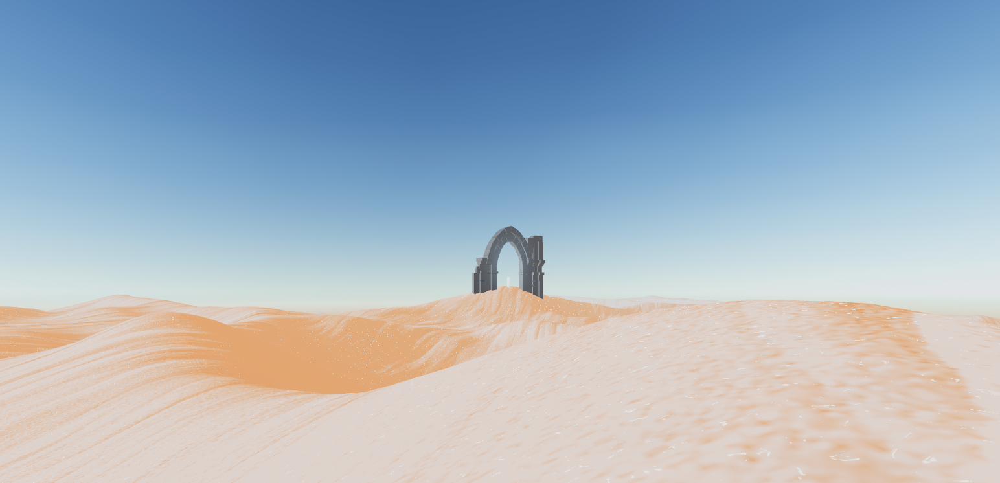
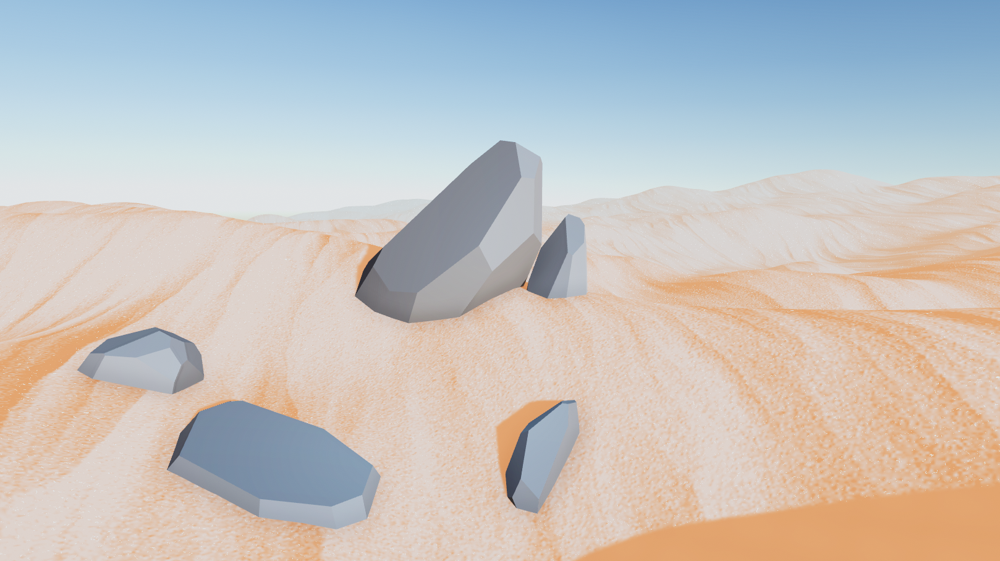
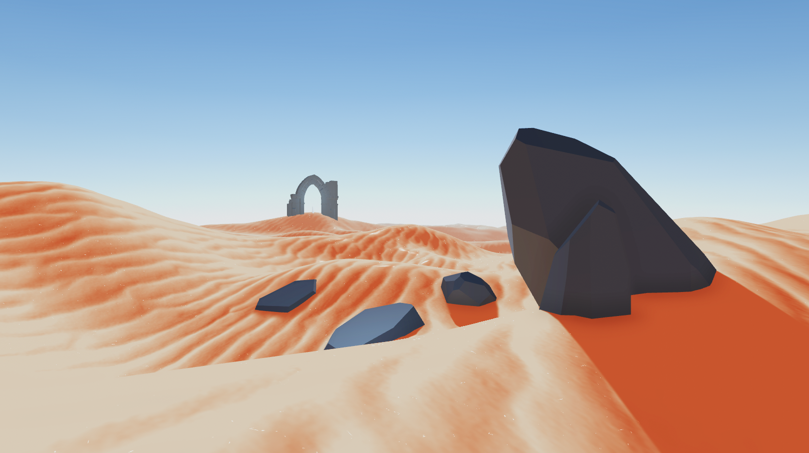
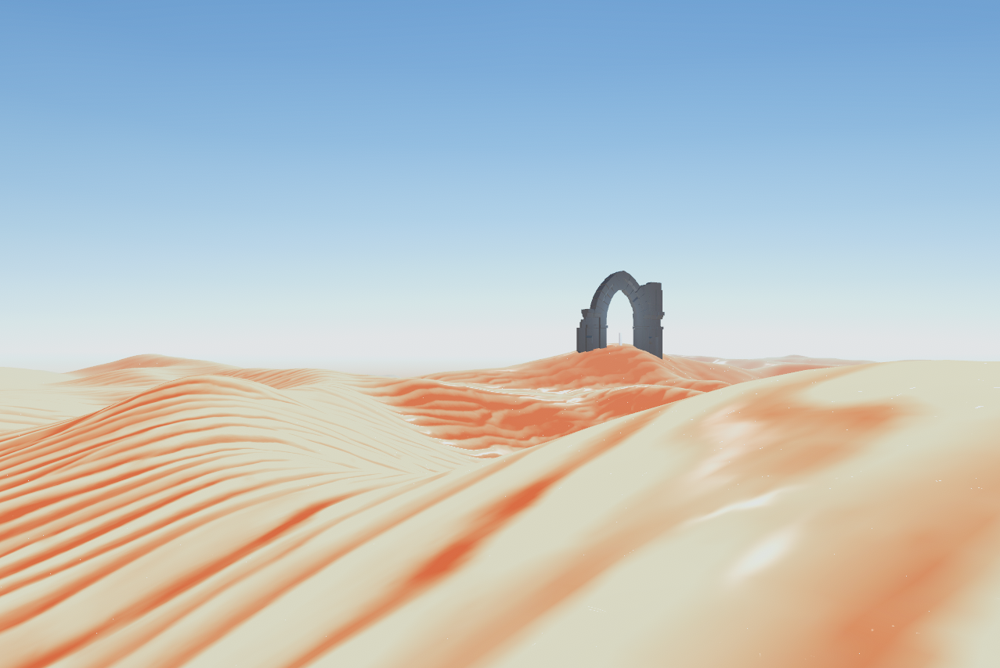
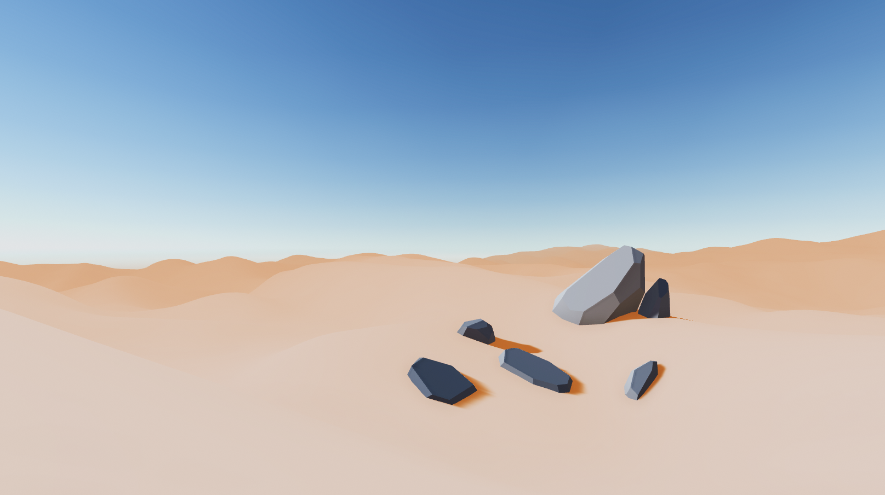
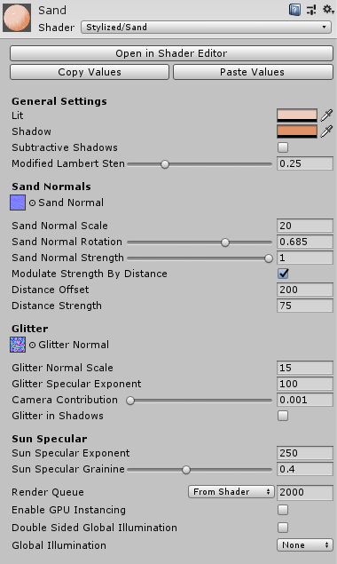

# Stylized Sand for Unity

## To Install

Download the [.unitypackage](https://github.com/danielshervheim/Stylized-Sand/releases/download/v2.0/stylized_sand_2.0.unitypackage), or clone this repository.

## To Use

Import the `.unitypackage` into your project.

##### Using a custom mesh
1. Import your mesh into Unity.
2. Drag it into the scene view and position it.
3. Drag one of the material presets in `Stylized Sand/Materials` onto the mesh in the scene view.

##### Using the Unity terrain system
1. Create and sculpt your Unity terrain.
2. Click on the terrain object in the scene view.
3. In the terrain object's inspector, select the settings tab (gear icon).
4. Select the `Material` dropdown and change the value from "Built in Standard" to "Custom".
5. Drag one of the material presets in `Stylized Sand/Materials` into the custom material slot.

## Options

